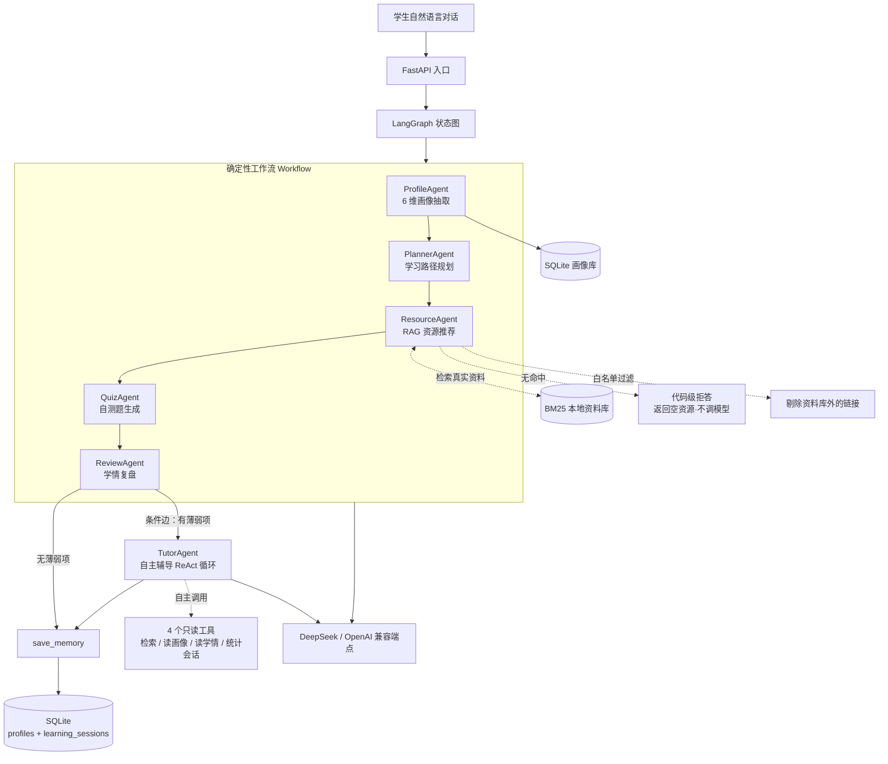
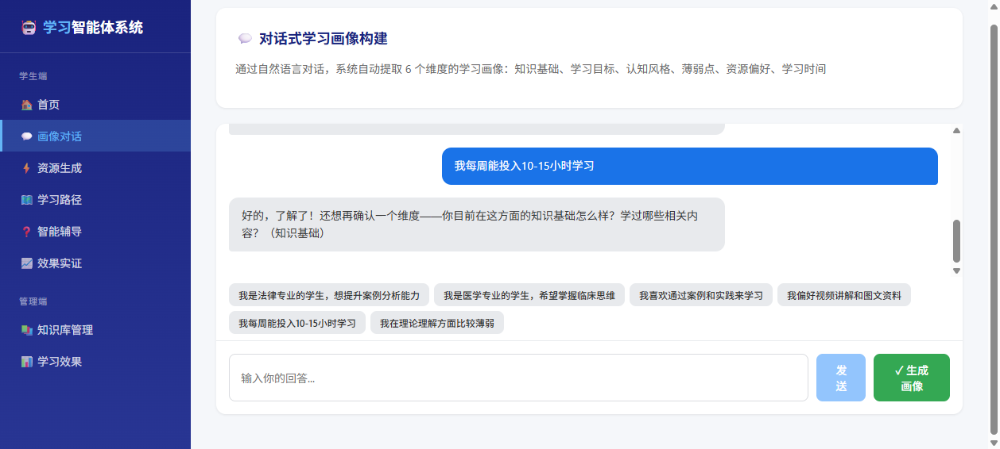
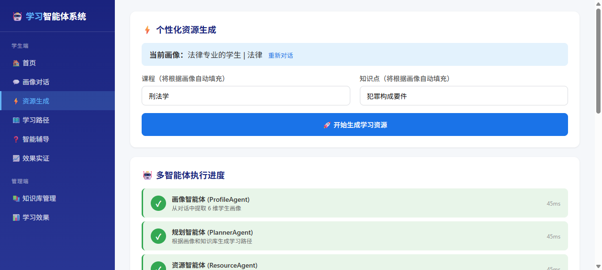
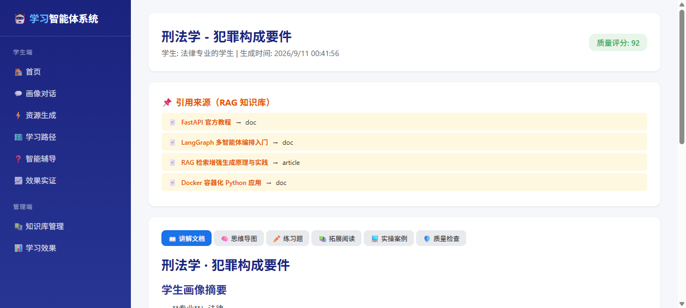
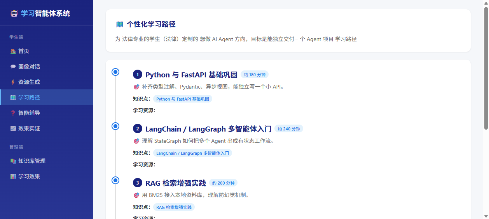
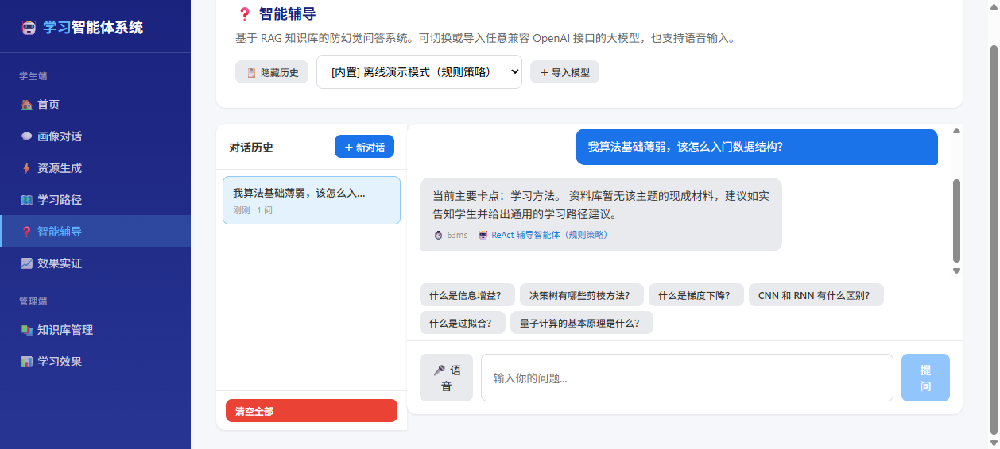
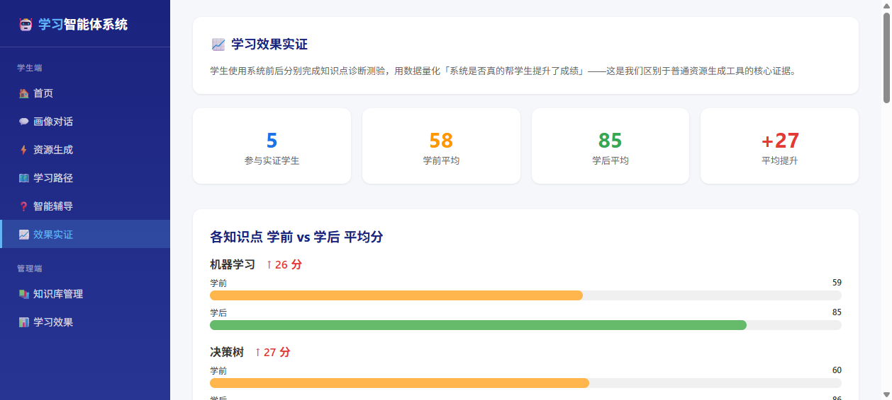
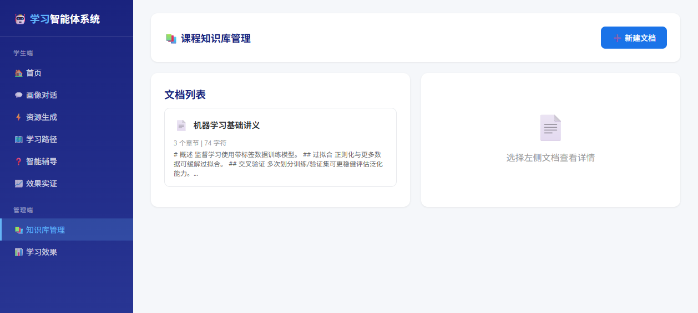
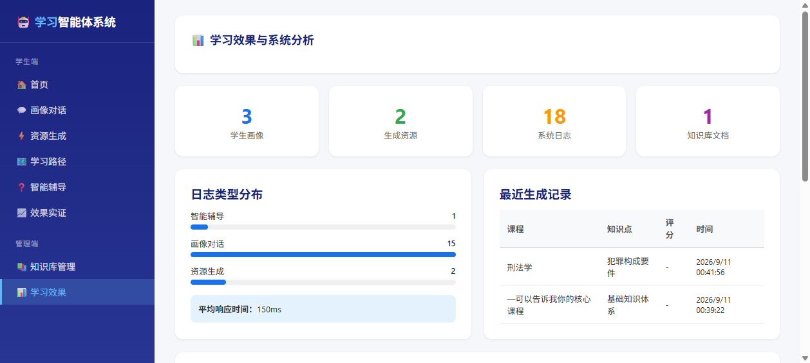

# Python Learning Agent · 个性化学习多智能体系统

> 基于 **LangGraph + FastAPI** 的对话式学习画像与多智能体学习系统 —— [A3 软件杯初赛作品](https://github.com/Dongnb66/a3-learning-agent)（Node.js 版）的 Python 重写。

**[English](README_EN.md)** | 中文


## 这是什么

学生用**自然语言对话**告诉系统自己的专业、学习目标、薄弱点、可用时间等信息，
系统用 **LangGraph 编排的状态图**自动完成闭环：

**load_memory（读取上次学情）→ 抽取 6 维学习画像 → 生成个性化学习计划 → 基于 RAG 推荐真实学习资源 → 出自测题 → 学情复盘 →（条件边：有薄弱项则进入自主辅导）→ save_memory（沉淀本次学情）。**

其中 `load_memory / save_memory` 两个记忆节点让系统能跨会话记住学生，做"上次 vs 本次"纵向对比；
`tutor`（自主辅导）节点是一个 **ReAct 式自主决策 Agent**——调哪些工具、调几轮、何时停止由模型在运行时自己决定。

这是 A3（Node.js 版）的 Python 迁移版：**业务逻辑对齐，技术栈换成 AI Agent 岗位主流栈**（Python · LangGraph · FastAPI · SQLAlchemy · Docker），并加入三层记忆（短期上下文 AgentState / 长期画像 profiles / 学情轨迹 learning_sessions）、RAG 防幻觉强化，以及自主工具调用循环。

## 核心特性

- **对话式画像构建（ProfileAgent）**：从对话抽取 6 维画像 —— 知识基础 / 学习目标 / 认知风格 / 薄弱点 / 资源偏好 / 学习时间；并用正则**高置信提取姓名 / 专业**覆盖 LLM 结果
- **学习计划（PlannerAgent）**：基于画像生成循序渐进的学习路径（含每步耗时）
- **资源推荐（ResourceAgent）· RAG 防幻觉（三道代码级硬约束）**：不是"在 prompt 里叮嘱模型别编"，
  而是把「不编造」做成**代码不变量**——
  ① **检索层留真**：BM25 带相关性阈值，无命中就返回空，绝不拿 0 分项凑数；
  ② **代码级拒答**：检索为空 → 直接返回空资源，**根本不调用模型**（没有事实依据就不生成）；
  ③ **白名单兜底**：模型返回的每一条，URL 必须能在本轮检索候选里对上（或标题能对上资料库），
  否则一律剔除；只给标题的会被归一化成资料库真实 URL。**模型就算幻觉，也过不了这一关。**
  已用 `tests/test_resource_guard.py` 确定性证明
- **自测题（QuizAgent）+ 学情复盘（ReviewAgent）**：闭环学习反馈
- **自主辅导（TutorAgent）· ReAct 工具调用循环**：复盘出薄弱项后，模型**自主决定**去查什么——
  可调用 4 个只读工具（检索真实资料 / 读长期画像 / 读上次学情 / 统计历史会话数），
  按「决策 → 调工具 → 观察 → 再决策」循环直到信息足够，最多 4 轮防失控；
  **每轮决策与观察都留成可审计的 `trace`**。无 Key 或模型异常时自动降级规则策略，管线不中断
- **LangGraph 编排**：状态图 `load_memory → profile → planner → resource → quiz → review → tutor → save_memory`，
  `review` 后接**条件边**——有薄弱项才进辅导循环，没有则直接收尾（该确定的地方确定，该自主的地方自主）
- **Provider 可换**：默认 DeepSeek（OpenAI 兼容协议），改 3 行配置即可切到 OpenAI / Claude / 通义千问 / 百炼 MaaS
- **类型安全**：Pydantic + 类型注解 + FastAPI 自动 OpenAPI 文档
- **可测试 + 可评测**：88 条单测全程不调用真实 LLM（mock / 脚本化假模型），无需 API Key；
  另含**防幻觉评测集**（`eval/bad_cases.json` + `scripts/run_eval.py`）——6 类用例 / 4 类断言，
  量化「编造链接数 = 0、来源可验证率 100%」，可挂 CI 做回归
- **Docker 一键起**：`docker-compose up`

## 架构



> 图中 `WF` 是**确定性工作流**（执行路径由代码固定，保证教学路径可复现）；
> `TutorAgent` 是**自主 Agent**（调什么工具、调几轮、何时停由模型运行时决定）。
> 两者刻意并存：该确定的地方确定，该自主的地方自主。
>
> `ResourceAgent` 的三道防幻觉约束（拒答 / 白名单）都在**代码层**，不依赖模型自觉。

## 技术栈

| 层 | 选型 | 为什么 |
|---|---|---|
| 后端 | FastAPI + Pydantic | 类型安全 + 自动 OpenAPI 文档 |
| Agent 编排 | LangGraph | 工业级多智能体框架，状态可视化 |
| LLM 接入 | LangChain `ChatOpenAI` + `function calling` 结构化输出 | DeepSeek / OpenAI / Claude 通吃，输出稳定解析为 Pydantic |
| RAG 检索 | BM25（langchain-community + rank-bm25） | 离线可用、无需 embedding API，足够演示防幻觉机制 |
| 存储 | SQLAlchemy 2.0 + SQLite | 零依赖，未来切 PostgreSQL 不改业务代码 |
| 部署 | Docker + docker-compose | 一键启动 |

## 快速开始

```bash
# 1. 克隆
git clone https://github.com/Dongnb66/python-learning-agent.git
cd python-learning-agent

# 2. 配置 API key
cp .env.example .env
# 编辑 .env，填入 LLM_API_KEY（默认 DeepSeek）

# 3a. 本地启动
pip install -e .
uvicorn app.main:app --reload --port 8000

# 3b. 或 Docker 一键起
docker-compose up
```

启动成功后，在浏览器打开 `http://localhost:8000/docs` 查看交互式 API 文档。

> ⚠️ **`localhost` 是你自己电脑上的地址** —— 本项目**没有部署线上 Demo**，
> 在 GitHub 页面里直接点这个链接是打不开的（它只会去连**点击者自己**的 8000 端口）。
> 想看效果请按上面的命令在本地跑起来：克隆 → `pip install -e .` → `uvicorn app.main:app`，
> 全程 3 条命令，**不需要任何 API Key**（不配 Key 自动走离线演示模式）。

### React 用户端（可视化界面）

除了 `/docs` 和 Gradio 页（`python app.py`，端口 7860），本项目内置一个
**9 页面的 React 用户端**（画像对话 / 资源生成 / 学习路径 / 智能辅导 / 前后测实证 / 知识库管理 / 学习分析）：

```bash
# 前置：后端已按上面步骤跑在 8000 端口
cd frontend
npm install
npm run dev
# 打开 http://localhost:5173
```

前端通过 Vite 代理把 `/api` 转发到 `http://localhost:8000`（见 `frontend/vite.config.js`），
所有页面走同一套多智能体后端，无需任何前端侧配置。

### 运行截图

| 画像对话 | 资源生成（多智能体执行进度） |
| --- | --- |
|  |  |

| 资源详情（RAG 引用来源） | 学习路径 |
| --- | --- |
|  |  |

| 智能辅导（ReAct 循环） | 前后测效果实证 |
| --- | --- |
|  |  |

| 知识库管理 | 学习效果分析 |
| --- | --- |
|  |  |

> 更多页面见 [screenshots/](screenshots/) 目录。

> **关于 `.env`**：由 `app/config.py` 在导入时统一加载，并且**同时注入 `os.environ`**。
> 本项目里 JWT 密钥、腾讯云短信、SMTP、微信/QQ 开放平台都是用 `os.getenv` 读的，
> 而 pydantic-settings 只把 `.env` 读进自己的 `Settings` 对象、不会写环境变量 ——
> 不显式注入的话这些配置写在 `.env` 里等于没配（详见下方「修复的真 bug」）。
> 已存在的 shell 环境变量优先，便于部署时覆盖。

### 修复的真 bug：`.env` 里的配置其实大半读不到

排查时发现 `.env.example` 里 27 个配置项，只有交给 pydantic `Settings` 的那几个
（`LLM_*` / `DATABASE_URL` / `APP_*`）真正生效，其余走 `os.getenv` 的**全部读不到**，
而且不会有任何报错：

| 配置 | 修复前的实际表现 |
|------|------------------|
| `LLM_API_KEY` | `app.py`（一键 Gradio 演示）判 `USE_MOCK = not bool(os.getenv("LLM_API_KEY"))` → 永远 `True`，**Demo 一直跑 mock 假数据** |
| `TENCENTCLOUD_*` | 短信永远走「演示模式」，不真实下发 |
| `WECHAT_*` / `QQ_*` | 第三方登录永远 mock 扫码 |
| `SMTP_*` | 邮箱验证码永远走演示模式 |
| `JWT_SECRET` | 模块级快照没拿到 → 每次启动随机生成，**重启后登录态全失效** |

已实测复现：`get_settings().llm_api_key` 有值，同一进程 `os.getenv("LLM_API_KEY")` 为 `None`。

修法（两道保险）：
1. `app/config.py` 新增 `load_env_file()` 并在**导入时**调用，把 `.env` 注入 `os.environ`；`env_file` 也改为**锚定项目根的绝对路径**，换目录启动不再失效。
2. `app/auth.py` 的 `JWT_SECRET` 与 `app.py` 的模式判断改为**调用时取值**（`_jwt_secret()` / `llm_configured()`），导入顺序再变也不会退化；占位符 Key 统一由 `config.has_usable_llm_key()` 识别，`tutor_agent` 复用同一实现，避免两套规则漂移。

回归断言在 `tests/test_env_loading.py`（18 条，含「`.env` 必须真的进 `os.environ`」「shell 变量优先」「JWT_SECRET 读时取值且签名/校验一致」）。

## API 端点

| 方法 | 路径 | 说明 |
|---|---|---|
| GET | `/health` | 健康检查 |
| POST | `/api/profile/build` | 仅构建学生画像 |
| POST | `/api/learn` | 跑完整多智能体流程（画像→计划→资源→测验→复盘） |
| GET | `/api/profile/{user_id}` | 从数据库读取已保存画像 |
| POST | `/api/auth/register` | 昵称+密码注册 |
| POST | `/api/auth/login` | 昵称+密码登录 |
| POST | `/api/auth/phone/login` | 手机号+密码登录 |
| POST | `/api/auth/third/login` | 微信/QQ 扫码登录（首次需手机号或邮箱验证码） |
| POST | `/api/auth/bind/contact` | 已登录用户绑定手机号/邮箱（需验证码） |
| GET | `/api/auth/me` | 当前登录用户信息 |
| GET | `/api/auth/me/identities` | 已绑定的账号身份列表 |
| POST | `/api/verify/send` | 发送验证码（腾讯云短信 / 邮箱 SMTP） |
| POST | `/api/verify/check` | 校验验证码 |
| GET | `/api/verify/channels` | 通道状态（真实下发 or 演示模式） |

### 快速体验

```bash
curl -X POST http://localhost:8000/api/learn \
  -H "Content-Type: application/json" \
  -d '{
    "user_id": "student-001",
    "messages": [
      {"role": "user", "content": "我叫杨运栋，软件工程专业，Python 基础一般，算法薄弱"},
      {"role": "user", "content": "我想做 AI Agent，每周学 10 小时，偏好视频"}
    ]
  }'
```

返回（节选）：

```json
{
  "profile": {
    "name": "杨运栋",
    "major": "软件工程",
    "knowledgeBase": {"level": "intermediate", "details": "Python 基础一般"},
    "learningGoal": {"level": "clear", "details": "想学习 AI Agent 方向"},
    "weakPoints": {"level": "high", "details": "算法基础薄弱"},
    "studyTime": {"level": "medium", "details": "每周约 10 小时"}
  },
  "plan": {"goal": "…", "steps": [ {"step": 1, "title": "Python 基础巩固", "est_minutes": 120} ]},
  "resources": [ {"title": "FastAPI 官方教程", "url": "https://fastapi.tiangolo.com/zh/", "type": "doc"} ],
  "quiz": {"questions": [ {"q": "…", "answer": "…"} ]},
  "review": {"mastery": "基础入门、方向明确", "suggestions": ["…"]}
}
```

> 资源推荐全部来自本地资料库的**真实链接**——这是 RAG 防幻觉机制的直接体现。

## 测试

```bash
pip install -e ".[dev]"
pytest -q
```

- `tests/test_profile.py`：画像抽取 + 姓名/专业正则（mock LLM）
- `tests/test_pipeline.py`：**端到端多智能体管线**（mock 全部 LLM，验证完整流程产出全部产物 + 条件边触发自主辅导）
- `tests/test_memory.py`：**跨会话记忆**（上次学情读回 / 多次会话累积取最近 / 记忆故障不阻塞主流程）
- `tests/test_tutor_agent.py`：**自主辅导 Agent**（ReAct 循环：真实执行工具 / 自主停止 / 轮数上限 /
  越权防护 / 模型异常降级 / 占位符 Key 识别 / 条件边分支）
- `tests/test_resource_guard.py`：**防幻觉三道硬约束**（无命中返回空 / 检索为空不调模型 / 白名单剔除编造链接）
- `tests/test_anti_hallucination_ablation.py`：**三道光约束的消融回归**——逐道关掉，断言"关掉就会变坏"，
  证明约束不是装饰（关掉白名单 → 编造 URL 确实漏出；关掉阈值 → 脏话题检索不再为空）
- `tests/test_eval_suite.py`：**评测器自检**（判定逻辑单测 + 离线跑完全部评测用例）
- `tests/test_tencent_sms.py`：TC3-HMAC-SHA256 签名对照腾讯云官方公开测试向量校验

共 **88 passed**。测试全程不调用真实 LLM（LLM 全部 mock 或用脚本化假模型），无需 API Key。

## 评测（防幻觉评测集）

「我的 RAG 能防幻觉」是一句无法验证的话。所以这里把它拆成**可判定的断言**：

```bash
python scripts/run_eval.py          # 零配置：无 Key 自动走离线桩，进程内跑完，无需起服务
```

它会跑 `eval/bad_cases.json` 里的 6 类用例（正常学生 / 姓名专业提取 / 薄弱点 / 冷门话题 /
目标明确 / 极简输入），对整条管线做 4 类断言：

| 断言 | 含义 |
|---|---|
| 产物齐全 | profile / plan / resources / quiz / review 五类都在 |
| **防幻觉命中率** | 每条推荐 URL 都必须能在本地资料库找到出处，**编造链接数必须为 0** |
| 拒答正确性 | 资料库无对应话题时，resources 应为空（正确拒答），而不是编造几条凑数 |
| 画像准确度 | 姓名 / 专业由正则层保底提取 |

输出控制台报告 + `eval/report_<时间戳>.json`（含防幻觉命中率），退出码非 0 即失败，可直接挂 CI。

```bash
# 对接真实模型（在 .env 配好 Key 后），额外验证「模型在约束下是否真的不编造」
python scripts/run_eval.py

# 对已启动的服务做端到端评测
uvicorn app.main:app --port 8000
python scripts/run_eval.py --base http://localhost:8000
```

当前结果：**6/6 通过，推荐 24 条资源，编造链接 0 条，防幻觉命中率 100%**。

> 注：`拒答` 分支在离线桩模式下无法通过端到端管线触达（桩的学习计划固定，检索总能命中）。
> 该分支由 `tests/test_resource_guard.py` 用确定性单测覆盖——**检索为空 → 返回空资源且模型零调用**。

### 消融实验：证明三道约束真的在起作用

「我有三道防幻觉约束」是**声明**；只有证明"关掉它就会变坏"，才变成**机制**。

```bash
python scripts/run_ablation.py      # 零配置，把模型换成"永远编造链接"的假模型
```

它把每道约束**单独关掉**，跑同一组输入做对比（实测结果）：

| 实验组 | 正常输入 | 脏输入（资料库无匹配） | 编造链接漏出 |
|---|---|---|---|
| ① 全约束（现状） | 1 条 | **0 条（正确拒答）** | **0 条** ✅ |
| ② 关掉相关性阈值 | 1 条 | 1 条（❌ 不再拒答） | 0 条 |
| ③ 关掉代码级拒答 | 1 条 | 0 条 | 0 条 |
| ④ 关掉 URL 白名单 | 1 条 | 0 条 | **1 条（❌ 幻觉出界）** |

读法：
- **②说明阈值是拒答的前置条件**——没有阈值，检索永远非空，"检索为空→拒答"的分支就永不触发；
- **④说明白名单是最后一道闸**——把模型换成"坏"的，编造的 URL 只有白名单能拦住；
- **③组未变化是符合预期的**：阈值在前，已经拦住了脏输入，拒答分支本就不会被走到。

> 诚实边界：消融实验在**机制层**做（直接调用 `resource` 节点 + 假模型），
> 不是对整条管线做。原因是整条管线在 mock 模式下学习计划为固定桩、检索总能命中，
> 三道约束都不会被触发，四组结果会完全一样——那样的实验是无效的。
> 对应的回归断言见 `tests/test_anti_hallucination_ablation.py`（挂在 CI 上）。

## 项目结构

```
python-learning-agent/
├── app/
│   ├── main.py            # FastAPI 入口（/api/learn、/api/profile/build …）
│   ├── a3_compat.py       # A3 React 用户端兼容 API 层（/api/* 信封契约 → 多智能体后端）
│   ├── a3_store.py        # 兼容层 JSON 存储（资源包 / 前后测记录 / 知识库文档 / 日志）
│   ├── efficacy_bank.py   # 前后测诊断题库（服务端判分）
│   ├── graph.py           # LangGraph 状态图：load_memory→profile→planner→resource→quiz→review→(条件边)tutor→save_memory
│   ├── tools.py           # Agent 工具层：4 个只读工具（RAG 检索/读画像/读学情/统计会话），零 LLM 依赖
│   ├── models.py          # Pydantic 模型：Profile / Plan / Resource / Quiz / Review / TutorSession / AgentState
│   ├── config.py          # 配置层：pydantic-settings 读 .env + 注入 os.environ
│   ├── llm.py             # ChatOpenAI 封装 + function calling 结构化输出（支持 MOCK_LLM 开关）
│   ├── mock_llm.py        # 离线桩：无 Key 也能跑通全流程（资源取自真实语料）
│   ├── eval_suite.py      # 防幻觉评测逻辑：用例载入 / 断言判定 / 指标汇总 / 报告落盘
│   ├── rag.py             # BM25 检索（防幻觉，带相关性阈值，无命中返回空）
│   ├── db.py              # SQLAlchemy + SQLite：profiles 长期画像 + learning_sessions 学情轨迹
│   ├── agents/
│   │   ├── profile_agent.py    # 6 维画像抽取 + 姓名/专业正则
│   │   ├── planner_agent.py    # 学习计划
│   │   ├── resource_agent.py   # RAG 资源推荐（拒答 + 白名单双重约束）
│   │   ├── quiz_agent.py       # 自测题
│   │   ├── review_agent.py     # 学情复盘
│   │   ├── memory_agent.py     # 跨会话记忆读写（纯 IO，故障隔离）
│   │   └── tutor_agent.py      # 自主辅导 Agent（ReAct 工具调用循环 + 条件边路由）
│   └── data/resources.json     # 本地资料库（RAG 语料）
├── eval/
│   ├── bad_cases.json     # 防幻觉评测集（6 类用例 + 断言）
│   └── adversarial_cases.json  # 对抗性用例（必然空检索，供消融实验用）
├── scripts/
│   ├── run_eval.py        # 评测 CLI（零配置，进程内跑完整管线）
│   └── run_ablation.py    # 消融实验 CLI（逐道关掉约束，验证"关掉就变坏"）
├── frontend/              # React 用户端（9 页面，Vite 代理 /api → 8000）
├── screenshots/           # 运行截图（README 引用）
├── tests/                 # pytest（mock LLM，无需 key）
├── Dockerfile
├── docker-compose.yml
└── .env.example
```

## 与 A3（Node.js 原版）的关系

两个仓库共享业务设计，本仓库是 A3 的 Python 重写：

| 维度 | A3 Node 版 | Python 版（本仓库） |
|---|---|---|
| 智能体设计 | ✓ 5 个 agent | ✓ 翻译保留 + 新增自主辅导 Agent |
| 6 维画像抽取 | ✓ | ✓ 逻辑对齐 + 姓名/专业正则 |
| RAG 防幻觉 | ✓ | ✓ 代码级三道约束（阈值检索 / 空命中拒答 / URL 白名单） |
| 跨会话记忆 | × | ✓ 三层记忆（AgentState / profiles / learning_sessions） |
| 自主决策 | × | ✓ ReAct 工具调用循环（LLM 自决调什么工具、调几轮、何时停） |
| 效果评测 | × | ✓ 防幻觉评测集（6 用例 / 4 类断言 / JSON 报告 / 可挂 CI）<br>✓ 消融实验（逐道关掉约束，证明约束非装饰） |
| 工程化 | Express + React | FastAPI + 可选前端 |
| Agent 框架 | 自写 orchestrator | **LangGraph**（含条件边） |
| Docker 部署 | × | ✓ |

## Roadmap

- [x] 5 个智能体 + LangGraph 状态图
- [x] RAG 防幻觉资源推荐（三道代码级约束）
- [x] FastAPI 端点 + SQLite 持久化
- [x] 跨会话三层记忆
- [x] 自主辅导 Agent（ReAct 工具调用循环）
- [x] 防幻觉评测集 + 评测 CLI（离线可跑）
- [x] 防幻觉消融实验 + 回归断言（"关掉就变坏"）
- [x] pytest 88 passed（mock LLM）+ Docker
- [ ] 前端（复用 A3 React 版）
- [ ] 在线 demo 部署
- [ ] 演示视频

## License

MIT
