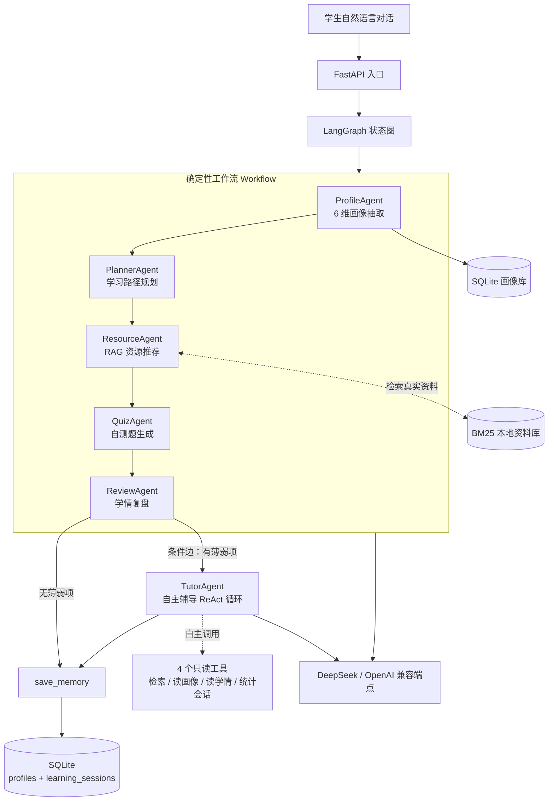

# Python Learning Agent · 个性化学习多智能体系统

> 基于 **LangGraph + FastAPI** 的对话式学习画像与多智能体学习系统 —— [A3 软件杯初赛作品](https://github.com/Dongnb66/a3-learning-agent)（Node.js 版）的 Python 重写。

**[English](README_EN.md)** | 中文


## 这是什么

学生用**自然语言对话**告诉系统自己的专业、学习目标、薄弱点、可用时间等信息，
系统用 **LangGraph 编排的状态图**自动完成闭环：

**load_memory（读取上次学情）→ 抽取 6 维学习画像 → 生成个性化学习计划 → 基于 RAG 推荐真实学习资源 → 出自测题 → 学情复盘 →（条件边：有薄弱项则进入自主辅导）→ save_memory（沉淀本次学情）。**

其中 `load_memory / save_memory` 两个记忆节点让系统能跨会话记住学生，做"上次 vs 本次"纵向对比；
`tutor`（自主辅导）节点是一个 **ReAct 式自主决策 Agent**——调哪些工具、调几轮、何时停止由模型在运行时自己决定。

这是 A3（Node.js 版）的 Python 迁移版：**业务逻辑对齐，技术栈换成 AI Agent 岗位主流栈**（Python · LangGraph · FastAPI · SQLAlchemy · Docker），并加入三层记忆（短期上下文 AgentState / 长期画像 profiles / 学情轨迹 learning_sessions）、RAG 防幻觉强化，以及自主工具调用循环。

## 核心特性

- **对话式画像构建（ProfileAgent）**：从对话抽取 6 维画像 —— 知识基础 / 学习目标 / 认知风格 / 薄弱点 / 资源偏好 / 学习时间；并用正则**高置信提取姓名 / 专业**覆盖 LLM 结果
- **学习计划（PlannerAgent）**：基于画像生成循序渐进的学习路径（含每步耗时）
- **资源推荐（ResourceAgent）· RAG 防幻觉**：先用 BM25 在本地资料库检索真实资料，LLM **只能基于检索到的真实链接**做推荐，从机制上抑制编造资源 / 链接的幻觉
- **自测题（QuizAgent）+ 学情复盘（ReviewAgent）**：闭环学习反馈
- **自主辅导（TutorAgent）· ReAct 工具调用循环**：复盘出薄弱项后，模型**自主决定**去查什么——
  可调用 4 个只读工具（检索真实资料 / 读长期画像 / 读上次学情 / 统计历史会话数），
  按「决策 → 调工具 → 观察 → 再决策」循环直到信息足够，最多 4 轮防失控；
  **每轮决策与观察都留成可审计的 `trace`**。无 Key 或模型异常时自动降级规则策略，管线不中断
- **LangGraph 编排**：状态图 `load_memory → profile → planner → resource → quiz → review → tutor → save_memory`，
  `review` 后接**条件边**——有薄弱项才进辅导循环，没有则直接收尾（该确定的地方确定，该自主的地方自主）
- **Provider 可换**：默认 DeepSeek（OpenAI 兼容协议），改 3 行配置即可切到 OpenAI / Claude / 通义千问 / 百炼 MaaS
- **类型安全**：Pydantic + 类型注解 + FastAPI 自动 OpenAPI 文档
- **可测试**：全部 LLM 调用可 mock，测试无需 API Key 即可跑通
- **Docker 一键起**：`docker-compose up`

## 架构



> 图中 `WF` 是**确定性工作流**（执行路径由代码固定，保证教学路径可复现）；
> `TutorAgent` 是**自主 Agent**（调什么工具、调几轮、何时停由模型运行时决定）。
> 两者刻意并存：该确定的地方确定，该自主的地方自主。

## 技术栈

| 层 | 选型 | 为什么 |
|---|---|---|
| 后端 | FastAPI + Pydantic | 类型安全 + 自动 OpenAPI 文档 |
| Agent 编排 | LangGraph | 工业级多智能体框架，状态可视化 |
| LLM 接入 | LangChain `ChatOpenAI` + `function calling` 结构化输出 | DeepSeek / OpenAI / Claude 通吃，输出稳定解析为 Pydantic |
| RAG 检索 | BM25（langchain-community + rank-bm25） | 离线可用、无需 embedding API，足够演示防幻觉机制 |
| 存储 | SQLAlchemy 2.0 + SQLite | 零依赖，未来切 PostgreSQL 不改业务代码 |
| 部署 | Docker + docker-compose | 一键启动 |

## 快速开始

```bash
# 1. 克隆
git clone https://github.com/Dongnb66/python-learning-agent.git
cd python-learning-agent

# 2. 配置 API key
cp .env.example .env
# 编辑 .env，填入 LLM_API_KEY（默认 DeepSeek）

# 3a. 本地启动
pip install -e .
uvicorn app.main:app --reload --port 8000

# 3b. 或 Docker 一键起
docker-compose up
```

打开 http://localhost:8000/docs 查看交互式 API 文档。

## API 端点

| 方法 | 路径 | 说明 |
|---|---|---|
| GET | `/health` | 健康检查 |
| POST | `/api/profile/build` | 仅构建学生画像 |
| POST | `/api/learn` | 跑完整多智能体流程（画像→计划→资源→测验→复盘） |
| GET | `/api/profile/{user_id}` | 从数据库读取已保存画像 |
| POST | `/api/auth/register` | 昵称+密码注册 |
| POST | `/api/auth/login` | 昵称+密码登录 |
| POST | `/api/auth/phone/login` | 手机号+密码登录 |
| POST | `/api/auth/third/login` | 微信/QQ 扫码登录（首次需手机号或邮箱验证码） |
| POST | `/api/auth/bind/contact` | 已登录用户绑定手机号/邮箱（需验证码） |
| GET | `/api/auth/me` | 当前登录用户信息 |
| GET | `/api/auth/me/identities` | 已绑定的账号身份列表 |
| POST | `/api/verify/send` | 发送验证码（腾讯云短信 / 邮箱 SMTP） |
| POST | `/api/verify/check` | 校验验证码 |
| GET | `/api/verify/channels` | 通道状态（真实下发 or 演示模式） |

### 快速体验

```bash
curl -X POST http://localhost:8000/api/learn \
  -H "Content-Type: application/json" \
  -d '{
    "user_id": "student-001",
    "messages": [
      {"role": "user", "content": "我叫杨运栋，软件工程专业，Python 基础一般，算法薄弱"},
      {"role": "user", "content": "我想做 AI Agent，每周学 10 小时，偏好视频"}
    ]
  }'
```

返回（节选）：

```json
{
  "profile": {
    "name": "杨运栋",
    "major": "软件工程",
    "knowledgeBase": {"level": "intermediate", "details": "Python 基础一般"},
    "learningGoal": {"level": "clear", "details": "想学习 AI Agent 方向"},
    "weakPoints": {"level": "high", "details": "算法基础薄弱"},
    "studyTime": {"level": "medium", "details": "每周约 10 小时"}
  },
  "plan": {"goal": "…", "steps": [ {"step": 1, "title": "Python 基础巩固", "est_minutes": 120} ]},
  "resources": [ {"title": "FastAPI 官方教程", "url": "https://fastapi.tiangolo.com/zh/", "type": "doc"} ],
  "quiz": {"questions": [ {"q": "…", "answer": "…"} ]},
  "review": {"mastery": "基础入门、方向明确", "suggestions": ["…"]}
}
```

> 资源推荐全部来自本地资料库的**真实链接**——这是 RAG 防幻觉机制的直接体现。

## 测试

```bash
pip install -e ".[dev]"
pytest -q
```

- `tests/test_profile.py`：画像抽取 + 姓名/专业正则（mock LLM）
- `tests/test_pipeline.py`：**端到端多智能体管线**（mock 全部 LLM，验证完整流程产出全部产物 + 条件边触发自主辅导）
- `tests/test_memory.py`：**跨会话记忆**（上次学情读回 / 多次会话累积取最近 / 记忆故障不阻塞主流程）
- `tests/test_tutor_agent.py`：**自主辅导 Agent**（ReAct 循环：真实执行工具 / 自主停止 / 轮数上限 /
  越权防护 / 模型异常降级 / 占位符 Key 识别 / 条件边分支）
- `tests/test_tencent_sms.py`：TC3-HMAC-SHA256 签名对照腾讯云官方公开测试向量校验

共 **30 passed**。测试全程不调用真实 LLM（LLM 全部 mock 或用脚本化假模型），无需 API Key。

## 项目结构

```
python-learning-agent/
├── app/
│   ├── main.py            # FastAPI 入口（/api/learn、/api/profile/build …）
│   ├── graph.py           # LangGraph 状态图：load_memory→profile→planner→resource→quiz→review→(条件边)tutor→save_memory
│   ├── tools.py           # Agent 工具层：4 个只读工具（RAG 检索/读画像/读学情/统计会话），零 LLM 依赖
│   ├── models.py          # Pydantic 模型：Profile / Plan / Resource / Quiz / Review / TutorSession / AgentState
│   ├── config.py          # pydantic-settings 读取 .env
│   ├── llm.py             # ChatOpenAI 封装 + function calling 结构化输出
│   ├── rag.py             # BM25 检索（防幻觉）
│   ├── db.py              # SQLAlchemy + SQLite：profiles 长期画像 + learning_sessions 学情轨迹
│   ├── agents/
│   │   ├── profile_agent.py    # 6 维画像抽取 + 姓名/专业正则
│   │   ├── planner_agent.py    # 学习计划
│   │   ├── resource_agent.py   # RAG 资源推荐
│   │   ├── quiz_agent.py       # 自测题
│   │   ├── review_agent.py     # 学情复盘
│   │   ├── memory_agent.py     # 跨会话记忆读写（纯 IO，故障隔离）
│   │   └── tutor_agent.py      # 自主辅导 Agent（ReAct 工具调用循环 + 条件边路由）
│   └── data/resources.json     # 本地资料库（RAG 语料）
├── tests/                 # pytest（mock LLM，无需 key）
├── Dockerfile
├── docker-compose.yml
└── .env.example
```

## 与 A3（Node.js 原版）的关系

两个仓库共享业务设计，本仓库是 A3 的 Python 重写：

| 维度 | A3 Node 版 | Python 版（本仓库） |
|---|---|---|
| 智能体设计 | ✓ 5 个 agent | ✓ 翻译保留 + 新增自主辅导 Agent |
| 6 维画像抽取 | ✓ | ✓ 逻辑对齐 + 姓名/专业正则 |
| RAG 防幻觉 | ✓ | ✓ BM25 检索约束资源推荐 |
| 跨会话记忆 | × | ✓ 三层记忆（AgentState / profiles / learning_sessions） |
| 自主决策 | × | ✓ ReAct 工具调用循环（LLM 自决调什么工具、调几轮、何时停） |
| 工程化 | Express + React | FastAPI + 可选前端 |
| Agent 框架 | 自写 orchestrator | **LangGraph**（含条件边） |
| Docker 部署 | × | ✓ |

## Roadmap

- [x] 5 个智能体 + LangGraph 状态图
- [x] RAG 防幻觉资源推荐
- [x] FastAPI 端点 + SQLite 持久化
- [x] pytest（mock LLM）+ Docker
- [ ] 前端（复用 A3 React 版）
- [ ] 在线 demo 部署
- [ ] 演示视频

## License

MIT
