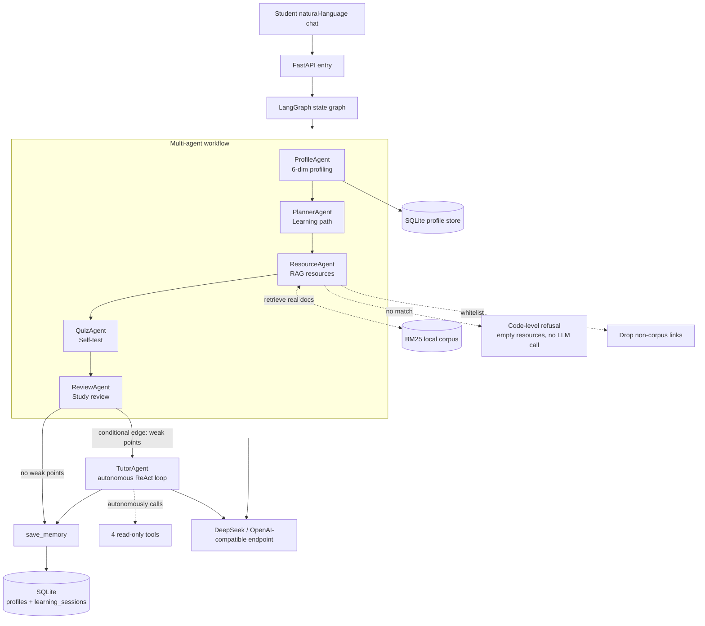

# Python Learning Agent · Personalized Learning Multi-Agent System

> A conversational learning-profiling and multi-agent tutoring system built with **LangGraph + FastAPI** — a Python rewrite of the [A3 Software Cup entry](https://github.com/Dongnb66/a3-learning-agent) (Node.js version).

English | **[中文](README.md)**


## What it is

A student tells the system — in **natural language** — their major, learning goals, weak points, available study time, and more. The system then runs a **LangGraph-orchestrated pipeline** in a closed loop:

**Load memory → extract a 6-dimension profile → generate a personalized plan → recommend real resources via RAG → create a self-test → produce a study review → (conditional edge) run an autonomous tutoring loop → save memory.**

`load_memory / save_memory` give the system cross-session memory (with a "last time vs. this time" comparison), while `tutor` is a **ReAct-style autonomous agent** — which tools to call, how many rounds, and when to stop are all decided by the model at runtime.

This is a Python migration of the A3 Node.js project: **business logic kept 1:1, tech stack switched to what AI-Agent roles actually ask for** (Python · LangGraph · FastAPI · RAG · SQLAlchemy · Docker).

## Key features

- **Conversational profiling (ProfileAgent)**: extracts a 6-dimension profile — knowledge base / learning goal / cognitive style / weak points / resource preference / study time — and uses regex to **confidently extract name / major** on top of the LLM result
- **Planning (PlannerAgent)**: builds a progressive learning path (with per-step time estimates) from the profile
- **Resource recommendation (ResourceAgent) · RAG anti-hallucination (three code-level guarantees)**: not "telling the model in the prompt not to make things up", but making "no fabrication" a **code invariant** — ① **thresholded retrieval**: BM25 with a relevance floor, so an unmatched topic returns *nothing* instead of padding with zero-score docs; ② **code-level refusal**: when retrieval is empty the node returns `[]` **without calling the model at all** (no evidence → no generation); ③ **URL whitelist**: every item the model returns must match this round's retrieved candidates (or a corpus title), otherwise it is dropped — title-only items are normalized to the real corpus URL. **Even if the model hallucinates, it cannot get through.** Proven by `tests/test_resource_guard.py`
- **Self-test (QuizAgent) + review (ReviewAgent)**: closed-loop learning feedback
- **Autonomous tutoring (TutorAgent) · ReAct tool-calling loop**: once the review surfaces weak points, the model **decides for itself** what to look up — 4 read-only tools (RAG retrieval / read profile / read last session / count sessions), looping through *decide → act → observe → decide again* until it has enough, capped at 4 rounds. Every decision and observation is recorded as an auditable `trace`. Falls back to a rule policy when no key is configured or the model errors out
- **LangGraph orchestration**: state graph `load_memory → profile → planner → resource → quiz → review → tutor → save_memory`, with a **conditional edge** after `review` — the tutoring loop only runs when weak points exist. (Deterministic where it should be, autonomous where it must be)
- **Swappable provider**: DeepSeek by default (OpenAI-compatible); switch to OpenAI / Claude / Qwen / Bailian MaaS by editing 3 lines
- **Type-safe**: Pydantic + type hints + auto-generated OpenAPI docs
- **Testable + evaluable**: 46 tests run with no real LLM calls and no API key; plus an **anti-hallucination evaluation suite** (`eval/bad_cases.json` + `scripts/run_eval.py`) — 6 cases / 4 assertion types quantifying "0 fabricated links, 100% verifiable sources", ready for CI
- **One-command Docker**: `docker-compose up`

## Architecture



> `WF` is a **deterministic workflow** (execution path fixed in code, so teaching paths stay reproducible);
> `TutorAgent` is an **autonomous agent** (which tools, how many rounds, when to stop are decided by the model at runtime).
> The two deliberately coexist — deterministic where it should be, autonomous where it must be.
>
> `ResourceAgent`'s three anti-hallucination guarantees (refusal / whitelist) live in **code**, not in the model's good intentions.

## Tech stack

| Layer | Choice | Why |
|---|---|---|
| Backend | FastAPI + Pydantic | Type safety + auto OpenAPI docs |
| Agent orchestration | LangGraph | Industrial-grade multi-agent framework with visual state |
| LLM access | LangChain `ChatOpenAI` + `function calling` structured output | Works with DeepSeek / OpenAI / Claude; reliably parses to Pydantic |
| RAG retrieval | BM25 (langchain-community + rank-bm25) | Offline, no embedding API needed; enough to demo anti-hallucination |
| Storage | SQLAlchemy 2.0 + SQLite | Zero-dependency; swap to PostgreSQL without touching business code |
| Deployment | Docker + docker-compose | One-command startup |

## Quick start

```bash
# 1. Clone
git clone https://github.com/Dongnb66/python-learning-agent.git
cd python-learning-agent

# 2. Configure API key
cp .env.example .env
# Edit .env and set LLM_API_KEY (DeepSeek by default)

# 3a. Run locally
pip install -e .
uvicorn app.main:app --reload --port 8000

# 3b. Or with Docker
docker-compose up
```

Open http://localhost:8000/docs for the interactive API docs.

## API endpoints

| Method | Path | Description |
|---|---|---|
| GET | `/health` | Health check |
| POST | `/api/profile/build` | Build the student profile only |
| POST | `/api/learn` | Run the full pipeline (profile → plan → resources → quiz → review) |
| GET | `/api/profile/{user_id}` | Load a saved profile from the database |

### Try it

```bash
curl -X POST http://localhost:8000/api/learn \
  -H "Content-Type: application/json" \
  -d '{
    "user_id": "student-001",
    "messages": [
      {"role": "user", "content": "I am a software-engineering student, average Python, weak at algorithms"},
      {"role": "user", "content": "I want to learn AI Agents, ~10 hours/week, prefer video"}
    ]
  }'
```

## Testing

```bash
pip install -e ".[dev]"
pytest -q
```

- `tests/test_profile.py`: profiling + name/major regex (mocked LLM)
- `tests/test_pipeline.py`: **end-to-end multi-agent pipeline** (mocks all LLMs, asserts every artifact + conditional-edge tutoring)
- `tests/test_memory.py`: cross-session memory (read-back / accumulate / failure isolation)
- `tests/test_tutor_agent.py`: autonomous tutoring agent (ReAct loop, self-termination, round cap, privilege guard, graceful degradation)
- `tests/test_resource_guard.py`: **the three anti-hallucination guarantees** (empty retrieval / no LLM call on refusal / whitelist drops fabricated links)
- `tests/test_eval_suite.py`: evaluator self-check (judgement logic + full offline case run)

**83 passed.** No real LLM is called — no API key needed.

## Evaluation (anti-hallucination suite)

"I built RAG so it won't hallucinate" is an unverifiable claim. So it is broken down into **decidable assertions**:

```bash
python scripts/run_eval.py          # zero-config: falls back to the offline stub, runs in-process, no server needed
```

It runs the 6 cases in `eval/bad_cases.json` against the whole pipeline with 4 assertion types:
artifact completeness; **anti-hallucination rate** (every recommended URL must exist in the local corpus — fabricated links must be 0); correct refusal on unknown topics; and deterministic profile fields.

It prints a report and writes `eval/report_<timestamp>.json` (including the anti-hallucination rate); a non-zero exit code means failure, so it drops straight into CI.

Current result: **6/6 passed, 24 resources recommended, 0 fabricated links, 100% anti-hallucination rate.**

> Note: the *refusal* branch cannot be reached through the end-to-end pipeline in offline-stub mode (the stub's plan is fixed, so retrieval always hits). It is covered by deterministic unit tests in `tests/test_resource_guard.py` — **empty retrieval → empty resources and zero model calls**.

## Relation to A3 (Node.js original)

Both repos share the same business design; this repo is the Python rewrite:

| Dimension | A3 Node.js | Python (this repo) |
|---|---|---|
| Agent design | ✓ 5 agents | ✓ ported + autonomous tutor agent |
| 6-dim profiling | ✓ | ✓ aligned + name/major regex |
| RAG anti-hallucination | ✓ | ✓ code-level: thresholded retrieval / refusal on empty hits / URL whitelist |
| Cross-session memory | × | ✓ 3-layer (AgentState / profiles / learning_sessions) |
| Autonomous decisions | × | ✓ ReAct tool-calling loop |
| Effect evaluation | × | ✓ anti-hallucination suite (6 cases / 4 assertion types / JSON report / CI-ready) |
| Engineering | Express + React | FastAPI + optional frontend |
| Agent framework | hand-rolled orchestrator | **LangGraph** (with conditional edges) |
| Docker deployment | × | ✓ |

## Roadmap

- [x] 5 agents + LangGraph state graph
- [x] Cross-session 3-layer memory
- [x] Autonomous tutoring agent (ReAct loop with tools)
- [x] RAG anti-hallucination resource recommendation
- [x] FastAPI endpoints + SQLite persistence
- [x] Anti-hallucination evaluation suite + CLI (runs offline)
- [x] pytest 83 passed (mocked LLM, no API key needed) + Docker
- [ ] Frontend (reuse the A3 React app)
- [ ] Hosted online demo
- [ ] Demo video

## License

MIT
